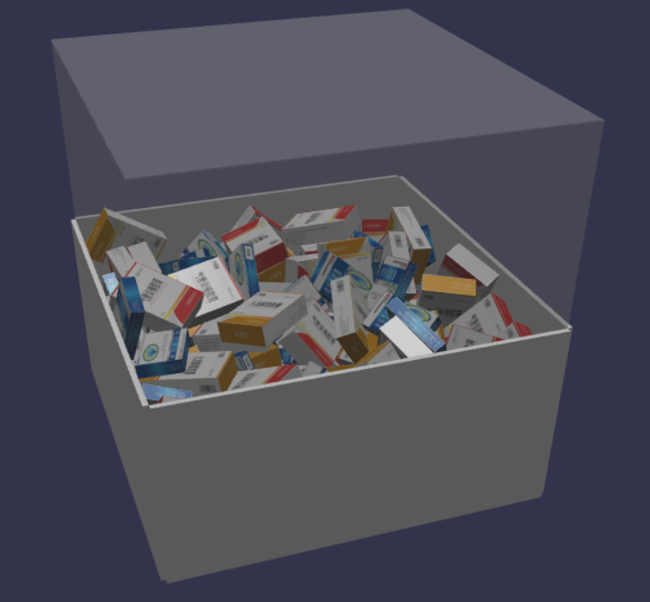
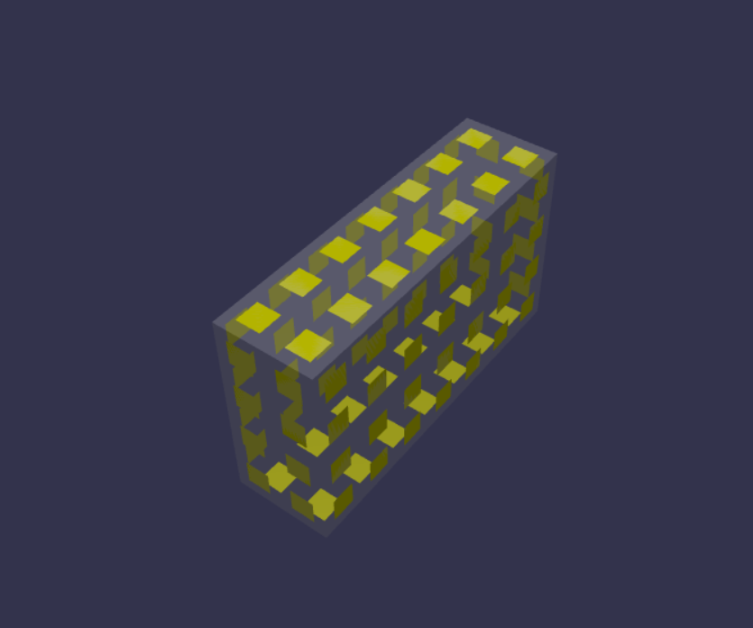
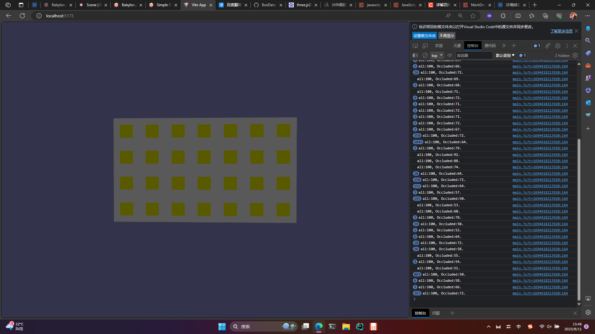
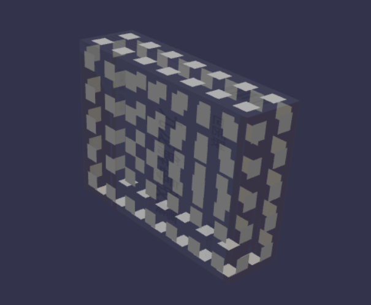
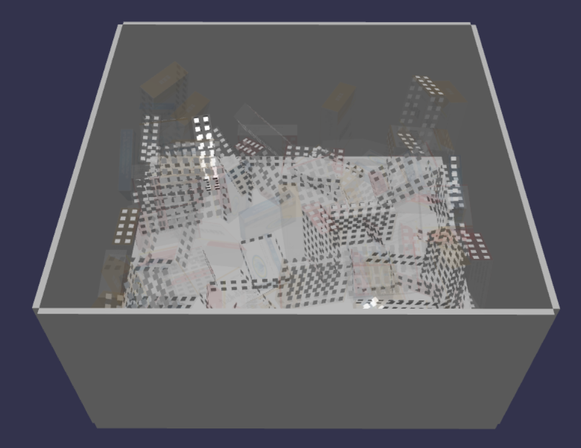
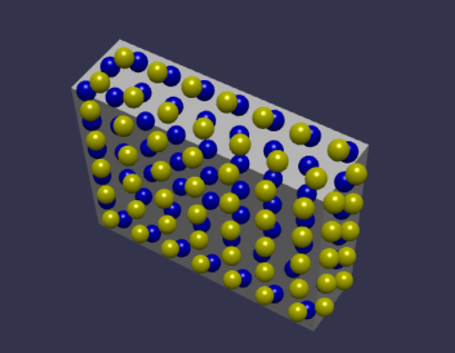

# 无序盒子抓取任务数据集生成器

## 项目介绍

近年来，随着快递行业和医药物流的飞速发展，包裹\医药分拣走上智能化道路。对包裹和药盒进行视觉定位是分拣任务中的重要步骤，大量的深度学习方法可以解决这个问题。但是由于缺少数据集，使得许多从业者或者研究人员不得不采用人工标注的方法来获得训练数据，也因此在数据标注上耗费了大量的时间。本项目试图采用生成虚拟数据集的方式来解决这一问题。与数据集相关的神经网络方法示例请参照链接。

## 工具介绍

本项目没有使用任何桌面3D渲染程序，而是选择使用网页端的3D渲染引擎Babylonjs来解决我们的问题。因此，您的PC上需要安装以下内容：

+ VScode
+ npm
+ yarn
+ Babylonjs
+ Cannon-en

## 数据集的标签介绍

标签包含的内容如下：

+ 盒子最佳抓取点（每个药盒一个）
+ 盒子姿态
+ 抓取难度评分

## 如何造成盒子的无序状态

开启物理引擎，使大量的盒子从空中坠入容器中。也正因为如此，为了防止盒子掉入虚空，我们为容器和盒子的掉落路径设置了空气墙。

## 数据集标签的生成逻辑

### 世界和相机视角中的抓取面

抓取面是指抓取点所在的表面。获得抓取面是我们获得所有标签的前提。这里需要注意，裸露在世界中的药盒表面并不一定存在于相机视角中，也就是说，即使这个裸露面是存在的，如果相机拍不到我们就应该当它不存在。因此，这里的抓取面应该特指相机视角中的抓取面。而获得该抓取面，需要判断药盒的表面是否存在于相机的视锥点云中。
判断逻辑如下：

1. ~~判断药盒在相机视角中是否可见或部分可见（弃用）~~
    + 原理[API](https://doc.babylonjs.com/features/featuresDeepDive/occlusionQueries "occlusionQueries")
        + 该判断的主要作用是减少后续对盒子表面点的计算，所以试图先抛弃一部分不可见的盒子。
    + isOccluded的奇怪特性
        + 只有物体完全不透明，才可能对它后面的物体造成遮挡；当物体是透明物体时，系统会判定为无法造成遮挡。
        + 对物体是否可见的判断将偏向于可见，这种判断十分的“不公正”，这种“不公正”造成的结果是，我们的杂乱堆放的盒子，仅仅有15%左右被判断为不可见，然而实际上，我们可见的盒子只有容器最上面的一层，这种判断显然不能够被我们使用。
    + 为盒子贴片
        + 为了更好的判断盒子表面的可见性和更好的获得可见的面积，我们选择将盒子的表面分割为正方形网格，这些网格代表表面的最小面积单元。后续的表面积计算和可见性计算都将依赖这些最小单元进行。
        + 虽然这样做会使得表面积的计算变得不准确，但是，逐点的计算盒子的表面积显然是不可能实现的，因此，我们只能采用这样的近似的方法。
        + 表面积的最小单元的大小为**s*s**，其中s代表的是机械臂吸盘的直径。
        + 经过测试，为盒子贴片能够完美的获得贴片是否被隐藏以及隐藏了多少，即使在贴片完全透明的情况下。
        + 为空间中随机位置随机姿态的盒子进行贴片，先将贴片的姿态和位置与盒子同步，这里需要注意，为了后续继续对姿态进行旋转，这里同步姿态必须要用[addRotation](https://doc.babylonjs.com/features/featuresDeepDive/mesh/transforms/center_origin/add_rotations)方法。在同步姿态和位置后，将贴片旋转使他们分别与盒子的六个表面平行。最后将贴片移动至盒子表面。完成盒子的贴片操作。
        + 贴片的最终结果
    + 贴片方法被弃用
        + 贴片所造成的结果不稳定
            + 由于Babylon对物体是否被遮挡的检测是异步的所以我们无法获得实时结果
            + 虽然[isOcclusionQueryInProgress](https://doc.babylonjs.com/typedoc/classes/BABYLON.AbstractMesh#isOcclusionQueryInProgress)能够对是否处理进行一定程度的判断，但是具有不确定性
            + 不同于单个盒子进行测试，多个盒子在一起测试时效果很糟糕，贴片嵌入盒子内部时会被判定为未被遮挡，而贴片嵌入盒子的状态在多个盒子的场景中是必然的。如果贴片被0距离贴在盒子表面，则会因为嵌入盒子而被判定为未被遮挡；如果与盒子表面有微小距离则会嵌入其他盒子，从而造成未被遮挡的结果
        + 由于需要新建许多贴片实体，造成十分严重的卡顿

    + 总结
        + Mesh的[isOccluded](https://doc.babylonjs.com/features/featuresDeepDive/occlusionQueries "occlusionQueries")属性是一个糟糕的属性，它在简单的环境中可以使用，但是稍微复杂的环境就会出现问题。而且，即使能够使用，**isOccluded**的一些特性也无法满足我们的所需
        + 放弃判断药盒的可见性

2. 计算盒子各个表面的裸露面积（**重点**）
    + 原理[playground](https://playground.babylonjs.com/#669TCN#4)
        + 判断盒子上的点与其在屏幕上呈现的位置的连线是否穿过实体
    + 对盒子的表面进行划分
        + 如同“为盒子贴片”中所述的一样，我们将盒子的表面换分为网格，单元格大小为**s*s**，其中s代表的是机械臂吸盘的直径
        + 获得每一个单元格的中心坐标，如果该中心被遮挡，则认为该单元格被遮挡离
        + 让每一个单元格的中心悬于盒子表面，因为如果中心落在表面上，则会被判定为遮挡
    + 单个盒子实验测试
        + 对单个盒子进行了测试。在实验中，在每一个单元格中心位置创建了一个小球
        + 如果小球被遮挡则变为蓝色，反之为黄色
        + 我们将小球和盒子在不同的渲染层进行了渲染
    + 整体效果，其中绿色部分代表裸露，红色部分代表未裸露

3. 最佳抓取点评价指标
    + 面积指标
        + sigmoid函数σ(x)∈[0.01, 0.99], x∈[-5, 5]
        + 将sigmoid函数右移(5+c)个单位，代表只有比机械臂吸盘面积大，才能够在面积指标上获得分数
        + 指标函数：1/(1+e^(-(x+5+c)))
    + 抓取方向指标
        + 抓取点法向量与容器底部平面法向量之夹角α的cos值，夹角越小对于机械臂来说越好抓取
        + 指标函数：cos(α)
    + 抓取难易程度指标
        + 综合考虑面积指标和抓取方向指标
        + 指标函数：10*cos(α)/(1+e^(-(x+5+c)))
4. 指标计算
    + 面积指标
        + 由于我们已经可以获得盒子各个面的裸露面积，所以面积指标可以直接带入公式计算

+ 抓取方向指标

        -

## 演示链接

1. 射线遮挡[ray](https://playground.babylonjs.com/#669TCN#4)

## BABYLON的小tip

1. 让mesh不可见可以大幅度的提高帧率。
