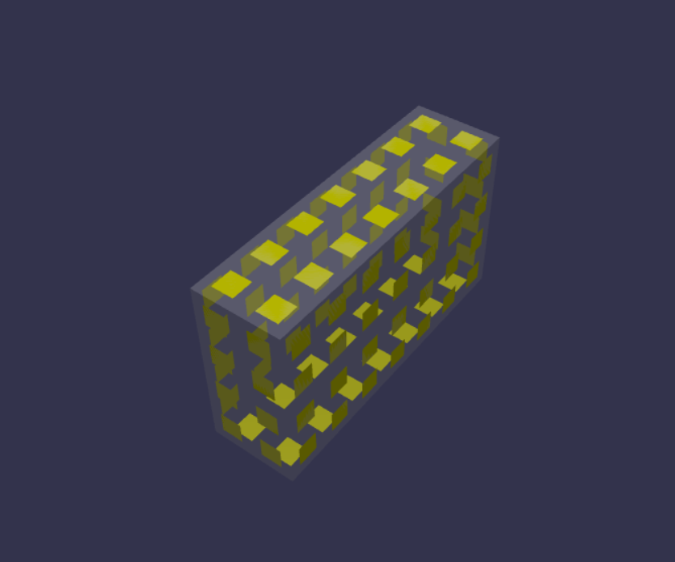

**无序盒子抓取任务数据集生成器**
========================
## 项目介绍
近年来，随着快递行业和医药物流的飞速发展，包裹\医药分拣走上智能化道路。对包裹和药盒进行视觉定位是分拣任务中的重要步骤，大量的深度学习方法可以解决这个问题。但是由于缺少数据集，使得许多从业者或者研究人员不得不采用人工标注的方法来获得训练数据，也因此在数据标注上耗费了大量的时间。本项目试图采用生成虚拟数据集的方式来解决这一问题。与数据集相关的神经网络方法示例请参照链接。
## 工具介绍
本项目没有使用任何桌面3D渲染程序，而是选择使用网页端的3D渲染引擎Babylonjs来解决我们的问题。因此，您的PC上需要安装以下内容：
+ VScode
+ npm
+ yarn
+ Babylonjs
+ Cannon-en
## 数据集的标签介绍
标签包含的内容如下：
+ 盒子最佳抓取点（每个药盒一个）
+ 盒子姿态
+ 抓取难度评分
## 如何造成盒子的无序状态
为开启物理引擎，使大量的盒子从空中坠入容器中。也正因为如此，为了防止盒子掉入虚空，我们为容器和盒子的掉落路径设置了空气墙。
## 数据集标签的生成逻辑
### 世界和相机视角中的抓取面
抓取面是指抓取点所在的表面。获得抓取面是我们获得所有标签的前提是。这里需要注意，裸露在世界中的药盒表面并不一定存在于相机视角中，也就是说，即使这个裸露面是存在的，如果相机拍不到我们就应该当它不存在。因此，这里的抓取面应该特指相机视角中的抓取面。而获得该抓取面，需要判断药盒的表面是否存在于相机的视锥点云中。
判断逻辑如下：
1. 判断药盒在相机视角中是否可见或部分可见
    + 原理[API](https://doc.babylonjs.com/features/featuresDeepDive/occlusionQueries "occlusionQueries")
        - 该判断的主要作用是减少后续对盒子表面点的计算，所以试图先抛弃一部分不可见的盒子。
    + isOccluded的奇怪特性
        - 只有物体完全不透明，才可能对它后面的物体造成遮挡；当物体是透明物体时，系统会判定为无法造成遮挡。
        - 对物体是否可见的判断将偏向于可见，这种判断十分的“不公正”，这种“不公正”造成的结果是，我们的杂乱堆放的盒子，仅仅有15%左右被判断为不可见，然而实际上，我们可见的盒子只有容器最上面的一层，这种判断显然不能够被我们使用。
    + 为盒子贴片
        - 为了更好的判断盒子表面的可见性和更好的获得可见的面积，我们选择将盒子的表面分割为正方形网格，这些网格代表表面的最小面积单元。后续的表面积计算和可见性计算都将依赖这些最小单元进行。
        - 虽然这样做会使得表面积的计算变得不准确，但是，逐点的计算盒子的表面积显然是不可能实现的，因此，我们只能采用这样的近似的方法。
        - 表面积的最小单元的大小为**s*s**，其中s代表的是机械臂吸盘的直径。
        
2. 求可见或部分可见的药盒表面与相机视锥的交点以获得药盒的裸露表面
    + 原理[^1]
        - **模型矩阵**将局部坐标系下的点转化为世界坐标系下的点。<u>局部坐标系=>世界坐标系</u>
        - **视图矩阵**将世界坐标系下的点转换为视图坐标系下的点。<u>世界坐标系=>视图坐标系</u>
        - **投影矩阵**将视图坐标系下的点转换到规范立方体之中。&emsp;<u>视图坐标系=>规范立方体</u>
    + 相关API
        - [computeWorldMatrix](https://doc.babylonjs.com/features/featuresDeepDive/mesh/transforms/center_origin/ref_frame):&emsp;**模型矩阵**

[^1]:[3D物体渲染到2D屏幕的矩阵变换过程：模型变换（Modeling Trans）、视图变换(View Trans)和投影变换(Projection Trans)](https://zhuanlan.zhihu.com/p/466508365)